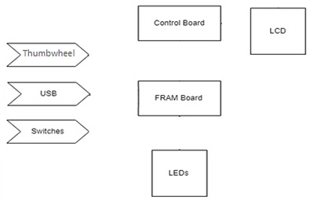

# Line Detecting MCU Motorized Vehicle
## An Embedded Systems Project with an Extreme Learning Curve

# Table of Content

1. [Scope](#scope)
2. [Overview](#overview)
    1. [Power System](#powersystem31)
    2. [Motors](#motors32)
    3. [User Interface](#userinterface33)
    4. [IR Emitter and Detector](#irdetector34)
    5. [Serial Communication Pins](#scp35)
    6. [IOT Module](#iotmodule36) 
3. [Test Process](#testprocess)
    1. [Power System](#powersystem51)
        - [Battery Supply Power Fix](#batterysupply61)
    2. [LCD Display/Switches](#lcddisplay62)
    3. [Motor Control](#motorcontrol63)
    4. [Shape Code](#shapecode64)
    5. [Line Detection](#linedetection65)
    6. [Transmittin and Receiving a Command](#command66)
    7. [Movement Using IOT Commands](#iotcommand67)
    8. [Wireless and Self-Guided Navigation](#navigation68)  
9. [Conclusion](#conclusion)

## 1. Scope 

This document details the electrical circuits, components, software, and procedures behind the development of an Autonomous Line Detecting Electric Unmanned Motorized Vehicle using the MSP430 development kit. 

The car is designed to locate, align path of travel, recognize, and maintain focus of, and finally follow a black line through a course autonomously.  During the production of the car, the team has several milestones, a number of which are merely to establish functionality and proof of concept.

The project was commissioned in Fall 2019. It was to be completed within 14 weeks. Deadlines were established to keep record of the progress. These deadlines were spread throughout the 14 weeks, usually with a week to two weeks between deadlines. 

**Note** A full documentation of this project can be seen in the wiki of this repository

<table>
  <tr>
    <td></td>
    <td></td>
  </tr>
  <tr style="text-align:center">
    <td>Front View of Line Detecting Car</td>
    <td>Top View of Line Detecting Car</td>
  </tr>
 </table>

## 2. Overview 
The vehicle consists of a 4 AA battery power supply, a control board with power circuit, two H-bridges that switch the direction of supplied voltage and allows for left and right motors, the MSP-EXP430FR2355 FRAM board, an IR emitter and IR detector, and an LCD display.

Overview Block Diagram

###    1. Power System 
The power system consists of 4 AA batteries, the control board, and a switch. The control board limits the voltage supplied to the FRAM board to ~3.3V and the switch allows the control board to be turned on or off when using battery power.

Power System Block Diagram

### 2. Motors 
The two H-bridges contain FETs which act as switches. These switches open to supply a positive or negative voltage to the motors via J43 and J21, driving the motors forward or backwards.

H-bridge Motor Control Block Diagram

### 3. User Interface 
The user interface consists of the FRAM and control boards. The FRAM board has a USB input for coding and debugging and two switches that serve as inputs. A Thumbwheel that will aid as menu selection mechanism. It also has LEDs that can be configured to give feedback to the user. The LCD is a part of the control board and can also provide feedback.

User Interface Block Diagram

### 4. IR Emitter and Detector 
One method that the car will be controlled is through an IR Emitter and Detector System. This system will emit an IR light that will bounce on the floor and be received by the IR detectors. This value is dependent on the bouncing properties of IR light on the black and white color of materials. Once the system has received such value, it will be converted to digital through an ADC converter, then use in the car guiding system.

IR Emitter and Detector Block Diagram

### 5. Serial Communication Pins 
The communication between the control board and external devices will be done through serial port pins. This communication can be done through a cable connected to specific pins or with IoT.

Serial Communication Pins Block Diagram

### 6. IOT Module 
An IOT module is implemented to communicate and control the vehicle wirelessly. The IOT will be reset and setup accordingly at the start of every vehicle run. Additionally, the IOT will communicate to the control board the IP address assigned and the control board will process and display this IP. The IOT will receive a string of characters from a wireless network and will transmit it to the control board. The control board will parse the string and apply commands according to the parsed information.

IOT Module Block Diagram

## 3. Test Process 
### 1. Power System 
When testing the power system, we supplied 4.5V to the board. Using an oscilloscope, we measured the voltage across two nodes, J12 and GND, and verified that the board was limiting the power being supplied to ~3.3V. 
The process was recreated using an Analog Discovery to emulate a power supply and oscilloscope. This can be seen in the figures below. Notice the voltage being measured at node J12 in Figure 63 is 3.3235V.

Power System Test Setup

Analog Discovery Output

### - Battery Supply Power Fix 
Due to an unforeseen issue with the battery powered voltage regulation circuit, the car had issues running with the battery pack.  The issue originated when the forward motion NFETs were switched off after running the motors.  The inductive load and the EMF of the motors caused the voltage of the net between the motors and the NFETs to become substantially low with respect to ground.  When the NFETs were switched back on, the current inrush due to the substantially low voltage nets would cause the LT1935 switching power regulator chip to shut down.  This was causing the students to have to “jump start” their cars from the USB ezFET connection to ensure expected operation of the vehicle.  The instructor Jim Carlson was able to diagnose and fix the issue by adding a 20k ohm resistor across the 5.0-volt pins of the power board, thus resolving the current inrush and power supply shutdown issue.  The two nets should be connected as they are the same voltage, but the trace was erroneously omitted when the board traces were designed.

Image of 20k Ohm Resistor Bridging the 5.0 V pins

### 2. LCD Display/Switches 
After installing the LCD to the control board, we ran precompiled code that wrote characters to the display. The switches on the FRAM board, SW1 and SW2, were also checked. When one switch was pressed, the characters on the display changed and when the other switch was pressed, the display would revert to the original state.

LCD on startup and after pressing SW1

LCD after pressing SW2

### 3. Motor Control 
After soldering each N-FET on to the FET circuit board we created some code in the software to test the functionality of the circuit.  After board initialization we set the P6DIR bits to high and measured the voltage across the leads coming from J41 and J21.  A measurement of ~5V was a successful test.

After creating the vehicle build and assembling it along with the motors, power circuit, and half H-Bridge (with N-FETs J21 and J41), the circuit is now designed to power itself with batteries independent of an outside power supply like a laptop. Testing was performed with a voltmeter after each component was installed on the H-Bridge board. Leads should be connected to a ground node and the output nodes L_FORWARD and R_FORWARD from the J43 and J21 nodes respectively. If P6DIR bits are set high, then the output voltage to the motors should be equivalent to battery voltage.

Once forward motor control was successfully, six more FETs were installed to complete the full H-bridge. Similar testing was done to confirm that the reverse motor control could be controlled using the L_REVERSE and R_REVERSE signals via leads connected to J43 and J41.

If voltages for each motor are both incorrect and different from each other, the problem likely lies in the port configurations for port 6 on the MSP430. If the voltages are the same but still incorrect, then it is likely a hardware issue like a short or a cold solder joint somewhere on the H-Bridge board.

Testing Nodes for Motor Control

### 4. Shape Code 
The code for generating shapes was tested in the following manner. The vehicle was set down on a 36”x36” square with black tape around the edges and black tape in the shape of a circle in the middle of the square. All of the shapes generated by the code were required to fit within the box. The vehicle had to be able to run all of the shapes without going back to the computer to download different code.
In order to pass the tests for circle, figure-eight, and triangle, the vehicle was required to run each shape twice and stop after the second pass. The tests were considered successful if the following conditions were met:
- Vehicle remained within the edges of the 36”x36” square
- Vehicle stopped where it began, with a leeway of 5-8%

Additional caveats of the project that were not graded:
- Menu system to select the shape/pattern routine to be run.
- Display the name of the shape pattern currently being run on the LCD
- Button debounce (delay between button press and action to prevent undesired multiple button presses)
- Implement button and debounce interrupt service routines

The figures below show a photograph of the 36”x36” test board and a photograph of a car mid-run of a circle shape.

36" x 36" Test Board

Mid-Run of a Circle Routine

### 5. Line Detection 
After installing the detectors, a test was required to make sure they could work as intended. It was required to display the readings of the detectors to the LCD display and show the differences between a reading of a black surface and a reading of a white surface. The functionality part of the test was as follows:
1. The vehicle should travel forward
2. The vehicle should stop and wait three seconds when it detects a black line
3. The vehicle should turn and align itself with the black line

### 6. Transmittin and Receiving a Command 
To test the serial communications of the vehicle, another FRAM board with test software installed was used. The function of this test board was to transmit a command (a string that consisted of ten characters) to the vehicle. The vehicle would then receive the command and transmit it back to the test board where it would be displayed on the last line of the LCD. This was done successfully with several different commands at two baud rates: 115,200 Hz and 460,800 Hz.
The entire test can be broken down as:
1.	Vehicle is waiting for a transmission in an idle state
2.	Test board transmits a command, vehicle receives it and displays it on the LCD
3.	After a switch press, vehicle transmits the command back to the test board where it is displayed on the LCD

This process is shown in the pictures below. The test board is on the right.

Waiting for a Command

Command Received

Command Transmitted

### 7. Movement Using IOT Commands 

Upon setting up the IOT module. Tests were conducted to make sure commands could be properly received from a device over Wi-Fi. The following requirements needed to be met for the test:

- Must transmit commands received on UCA0RXD out UCA1TXD to be able to see output from the IOT module using a terminal emulator such as Termite.
- A command structure must be implemented in a way that the board can process information being relayed over the IOT device.
- The board must be able to process commands for resetting the IOT module, setting different baud rates, and motor functions. The commands for the motor functions must be able to make the car move forward, reverse, turn right, and turn left. All of the movement commands must be able to be set for a specific amount of time.
- The board must be able to process multiple commands from one transmission. For example, sending a forward for one second command and a reverse for two seconds command in the same transmission.  An example of a command transmission could be “<DF0200>” where the “<” indicates the beginning of the command, “DF” is the direction drive forward, “0200” would be for 2 seconds, and finally “>” would conclude the command.  All other ascii characters outside of the “<>” structure would be directed to the Wi-Fi module as input to control that module. Multiple commands in a single transmit would be strung together as “<DF0200><TR0050><DF0100>” this could be translated as drive forward for 2 seconds, turn right for 500 ms, and then drive forward for 1 second.

### 8. Wireless and Self-Guided Navigation   

The final test for the Unmanned Motorized Vehicle was to navigate a course utilizing both methods of movement developed during the development phase. The vehicle was required to navigate a part of the course via commands received from an external device over Wi-Fi, and to navigate a part of the course utilizing the vehicle’s onboard sensors. This was also partially a test for power consumption, because the vehicle had to be operated for a much longer period of time than in previous tests. The following conditions were to be met:
- Must travel to 8 separate locations, each with a specific number, via wireless control.
- Must display the location number upon arrival at the location.
- Once within two feet of the final location, the car must navigate to the location and be sent a command to autonomously navigate to a black line course within 45 seconds.
- The car must navigate itself to a board containing the black line course.
- The vehicle must intercept the black line and align itself with it.
-	It must follow the black line by use of its sensors.
- It must merge onto and complete two rotations of the circle at the end of the course.
- It must be able to receive an exit command from a remote device.
- It must successfully exit the course and stop.

Self-Guided Navigation Course

## 9. Conclusion 

A few important details and lessons stood out about the project as a whole.

First, the importance of mentoring in a fast paced enviroment is crucial. Mentoring was avaiable via online or in the lab. 

Secondly, a well structured project eased the creation, debugging and assembly of the project. Each new addition to the car built on the foundation implemented in the previous step until there was a complete project. For example, several projects led to the ability to navigate a black line. It started with simply getting forward movement. After this, reverse movement was implemented, and later added the ability to make turns quickly. 

Finally, sensors were mounted so that information about the vehicle’s surrounding could be processed, leading to the ability to locate a black line and traverse it. A similar structure was used to add the IoT/Serial communication functionality.

Overall the ability to problem solve, stress management skills, debugging, and engineering skills were undoubtedly refined with this project.
