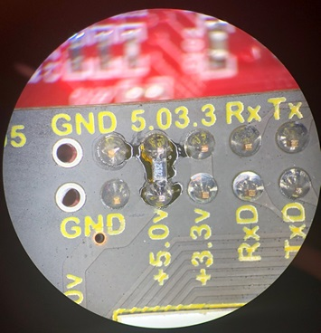
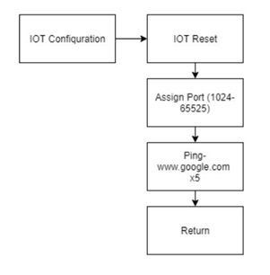

# Line Detecting MCU Motorized Vehicle
## An Embedded Systems project with an Extreme Learning Curve

# Table of Content

1. [Scope](#scope)
2. [Abbreviations](#abbreviations)
3. [Overview](#overview)
    1. [Power System](#powersystem31)
    2. [Motors](#motors32)
    3. [User Interface](#userinterface33)
    4. [IR Emitter and Detector](#irdetector34)
    5. [Serial Communication Pins](#scp35)
    6. [IOT Module](#iotmodule36) 
4. [Hardware](#hardware)
    1. [Power System](#powersystem41)
    2. [Motors](#motors42)
    3. [User Interface](#userinterface43)
        - [LCD](#lcd43)
    4. [IR Emitter and Decetcor](#irdetector44)
    5. [Serial Communication Pins](#scp45)
    6. [IOT Module](#iotmodule46)
5. [Power Analysis](#poweranalysis)
6. [Test Process](#testprocess)
    1. [Power System](#powersystem51)
        - [Battery Supply Power Fix](#batterysupply61)
    2. [LCD Display/Switches](#lcddisplay62)
    3. [Motor Control](#motorcontrol63)
    4. [Shape Code](#shapecode64)
    5. [Line Detection](#linedetection65)
    6. [Transmittin and Receiving a Command](#command66)
    7. [Movement Using IOT Commands](#iotcommand67)
    8. [Wireless and Self-Guided Navigation](#navigation68)  
7. [Software](#software)
    1. [main](#main71)
    2. [Initialization](#init72)
    3. [Interrupts](#interrupt73)
    4. [IOT](#iot74)
    5. [Transimt Signal](#tsignal75)
    6. [Line Detection Course Execution](#lineexecution76)
8. [Flowchart](#flowchart)
    1. [Main](#main81)
    2. [Initialization](#initialization82)
        - [Timer Initialization](#timerinit82)
        - [Port Initialization](#portinit82)
        - [Serial Initialization](#serialinit82)
    3. [Interrupts](#interrupts83)
    4. [IOT](#flowiot84)
        - [IOT Configuration](#iotconf84)
        - [IOT Command Type](#iotct84)
        - [IOT Command Interval](#iotci84)
    5. [Transmit Signal](#transmitsignal85)
    6. [Line Detection Course Execution](#linecourse86)  
9. [Conclusion](#conclusion)

## 1. Scope 

This document details the electrical circuits, components, software, and procedures behind the development of an Autonomous Line Detecting Electric Unmanned Motorized Vehicle using the MSP430 development kit.  The car is designed to locate, align path of travel, recognize, and maintain focus of, and finally follow a black line through a course autonomously.  During the production of the car, the team has several milestones, a number of which are merely to establish functionality and proof of concept.
The project was commissioned in Fall 2019. It was to be completed within 14 weeks. Deadlines were established to keep record of the progress. These deadlines were spread throughout the 14 weeks, usually with a week to two weeks between deadlines. 

## 2. Abbreviations 

| Abbreviation: | Description: |
| --- | ----------- |
| ADC | Analog to Digital Converter |
| FET | Field-Effect Transistor |
| FRAM | Ferroelectric Random-Access Memory |
| IAR Embedded Workbench | a development environment that includes a C/C++ compiler, code analysis tools, security tools, debugging and trace probes. |
| IOT | Internet of Things |
| IR | Infrared Emitter / Detector  |
| LCD | Liquid Crystal Display |
| MOSFET | Metal–Oxide–Semiconductor Field-Effect Transistor |
| NFET | N-channel MOSFET |
| PFET | P-channel MOSFET |
| PCB | Printed Circuit Board |
| PID | Proportional Integral Derivative |
| PWM | Pulse Width Modulation |

## 3. Overview 
The vehicle consists of a 4 AA battery power supply, a control board with power circuit, two H-bridges that switch the direction of supplied voltage and allows for left and right motors, the MSP-EXP430FR2355 FRAM board, an IR emitter and IR detector, and an LCD display.

Overview Block Diagram

###    1. Power System 
The power system consists of 4 AA batteries, the control board, and a switch. The control board limits the voltage supplied to the FRAM board to ~3.3V and the switch allows the control board to be turned on or off when using battery power.

Power System Block Diagram

### 2. Motors 
The two H-bridges contain FETs which act as switches. These switches open to supply a positive or negative voltage to the motors via J43 and J21, driving the motors forward or backwards.

H-bridge Motor Control Block Diagram

### 3. User Interface 
The user interface consists of the FRAM and control boards. The FRAM board has a USB input for coding and debugging and two switches that serve as inputs. A Thumbwheel that will aid as menu selection mechanism. It also has LEDs that can be configured to give feedback to the user. The LCD is a part of the control board and can also provide feedback.

User Interface Block Diagram

### 4. IR Emitter and Detector 
One method that the car will be controlled is through an IR Emitter and Detector System. This system will emit an IR light that will bounce on the floor and be received by the IR detectors. This value is dependent on the bouncing properties of IR light on the black and white color of materials. Once the system has received such value, it will be converted to digital through an ADC converter, then use in the car guiding system.

IR Emitter and Detector Block Diagram

### 5. Serial Communication Pins 
The communication between the control board and external devices will be done through serial port pins. This communication can be done through a cable connected to specific pins or with IoT.

Serial Communication Pins Block Diagram

### 6. IOT Module 
An IOT module is implemented to communicate and control the vehicle wirelessly. The IOT will be reset and setup accordingly at the start of every vehicle run. Additionally, the IOT will communicate to the control board the IP address assigned and the control board will process and display this IP. The IOT will receive a string of characters from a wireless network and will transmit it to the control board. The control board will parse the string and apply commands according to the parsed information.

IOT Module Block Diagram

## 4. Hardware 

### 1. Power System 
The schematics for the power system and an image of the power board are shown below. The batteries connect to node J0, which is connected to a switch, and to ground. The switch connects the batteries to the circuit when it is on and disconnects them when it is off. There is a diode, D2, connected between C7 and C12. This diode is a safety net incase the batteries are connected with terminals switched. It prevents power from being supplied to the circuit unless the batteries are connected properly.

Power System Schematic

### 2. Motors 
The schematics for the motor H-bridges are shown below. The nodes (depicted on the following schematics), L_FORWARD, L_REVERSE, R_FORWARD, and R_REVERSE are port pins controlled by the MSP430. Changing L_FORWARD pin to a high output turns on the following FETs: Q41 and Q42. Q41 connects L_MOTOR_REVERSE to ground, and Q42 turns on the Q43 which supplies voltage to L_MOTOR_FORWARD. Supplying power in this way turns the motor on in the forward direction. This process is the same with regards to R_FORWARD, just with FETs Q21, Q22, and Q23.

Changing L_REVERSE to a high output turns on the following FETs: Q31 and Q32. Turning on Q31 connects L_MOTOR_FORWARD to ground. Turning on Q32 turns on Q33 which connects L_MOTOR_REVERSE to power. When power is supplied this way, the motor will operate in the reverse direction.

**NOTE:** Never turn L_FORWARD and L_REVERSE on at the same time, this will destroy the motors. The same caution should be observed with R_FORWARD and R_REVERSE as well.  The time delay “Tau” can be determined by measuring the time for the current to sufficiently slow.  If the motor is in forward motion, once the forward pin has been turned off measure the time it takes for the current through J43 to dissipate to zero.

Left side H-Bridge Schematic

Right side H-Bridge Schematic

### 3. User Interface 
### - LCD 
The figure below details the schematics for the LCD circuit. Power is supplied to the LCD display by node PWR3_3. The node LCD_BACKLITE is connected to a FET, Q50 that acts as a switch. When LCD_BACKLITE is high, the FET is enabled and the circuit to the backlight is completed, which turns on the backlight. When LCD_BACKLITE is low, the circuit is incomplete, and the backlight is off. 

LCD Schematic

### 4. IR Emitter and Decetcor 
The schematic for the infrared emitter and detector is shown in the figure below. D3 is the emitter diode. DQ1 and DQ2 are the detectors. The emitter is connected to the board through an NFET. When the NFET receives a high value from the node IR_LED, it completes the emitter circuit, and turns on the emitter. The detectors are connected to the ADC with a pullup resistor. When a detector is not receiving any IR signals, the IR sensitive materials within the detector are very resistive. This results in the voltage read by the ADC being close to the voltage provided by the pullup resistor. When a detector is receiving IR signals, the IR sensitive materials become less resistive. This results in the voltage read by the ADC being pulled towards ground. These phenomena allow detection between black and white surfaces. Black absorbs most forms of light, and white reflects most forms. This means that when the IR Emitter is on, and the detectors are angled correctly, the ADC should read a high value when the detectors are over a black surface, and low values when the detectors are over a white surface.

IR Emitter and Detector Schematic

### 5. Serial Communication Pins 
The serial communication pins are located on J1, J14, and J17. J1 has the UCA0TXD and UCA0RXD pins, while J14 and J17 have the UCA1TXD and UCA1RXD pins. These pins are used to communicate with external devices such as an IOT module. The TXD pins are used to transmit signals and the RXD pins are used to receive signals. Both pins are interrupt enabled. The TXD pins will trigger an interrupt when the UCAxTXBUF register is empty and ready to receive a new character to transmit. The RXD pins will trigger an interrupt when a character has been received and is ready to be read from the UCAxRXBUF register.

Port Pin Schematic

### 6. IOT Module 
The IOT module connects to the control board via J61. Communications between the IOT device and the MSP430 occur utilizing the UCA0TXD and UCA0RXD serial communication pins. In order to communicate with the IOT, it must undergo a hardware reset. This is done by setting the IOT_RESET pin low for at least 100 milliseconds, and then setting it high. After that, commands can be sent to the IOT via the UCA0TXD pin. With the programming installed on the IOT module, it will communicate with a baud rate of 115200 after a factory reset. The pins PROGRAM_SELECT and PROGRAM_MODE are used when programming the IOT module. The diodes D61 and D62 can be turned on by activating the corresponding pins IOT_LINK and IOT_RUN. These pins are activated by sending specific commands to the IOT module.  Some helpful commands after the reset are: “AT+WKEEPALIVE=5”, this sends an “I’m still here don’t disconnect me” message to the network router to ensure disassociation events are eliminated.  “AT+NSTAT” this will reply with all of the network specifics like the SSID and the IP address.

IOT Module Circuit Schematic

## 5. Power Analysis 
The power consumption of the system varies greatly depending on the peripherals being used, the most demanding out of those being the motors, IR emitter, and LCD backlight. Using these heavily will decrease the total time the vehicle can operate fully. Sluggish motors will be the first sign that new batteries are needed. Due to the high voltage requirement, they will be the first to show unexpected behavior or unresponsiveness despite the rest of the vehicle operating properly. If this is the case, a new set of batteries is recommended.

From our testing, we determined that the system can operate fully, i.e. motor control, Wi-Fi communication, and IR emitter, for upwards of 1 hour and 40 minutes using a new set of batteries (or rechargeable batteries with a combined voltage 6.4 V). This value was obtained from both real-word usage and by measuring the power draw from each component throughout the process of assembling the vehicle.

## 6. Test Process 
### 1. Power System 
When testing the power system, we supplied 4.5V to the board. Using an oscilloscope, we measured the voltage across two nodes, J12 and GND, and verified that the board was limiting the power being supplied to ~3.3V. 
The process was recreated using an Analog Discovery to emulate a power supply and oscilloscope. This can be seen in the figures below. Notice the voltage being measured at node J12 in Figure 63 is 3.3235V.

Power System Test Setup

Analog Discovery Output

### - Battery Supply Power Fix 
Due to an unforeseen issue with the battery powered voltage regulation circuit, the car had issues running with the battery pack.  The issue originated when the forward motion NFETs were switched off after running the motors.  The inductive load and the EMF of the motors caused the voltage of the net between the motors and the NFETs to become substantially low with respect to ground.  When the NFETs were switched back on, the current inrush due to the substantially low voltage nets would cause the LT1935 switching power regulator chip to shut down.  This was causing the students to have to “jump start” their cars from the USB ezFET connection to ensure expected operation of the vehicle.  The instructor Jim Carlson was able to diagnose and fix the issue by adding a 20k ohm resistor across the 5.0-volt pins of the power board, thus resolving the current inrush and power supply shutdown issue.  The two nets should be connected as they are the same voltage, but the trace was erroneously omitted when the board traces were designed.

Image of 20k Ohm Resistor Bridging the 5.0 V pins

### 2. LCD Display/Switches 
After installing the LCD to the control board, we ran precompiled code that wrote characters to the display. The switches on the FRAM board, SW1 and SW2, were also checked. When one switch was pressed, the characters on the display changed and when the other switch was pressed, the display would revert to the original state.

LCD on startup and after pressing SW1

LCD after pressing SW2

### 3. Motor Control 
After soldering each N-FET on to the FET circuit board we created some code in the software to test the functionality of the circuit.  After board initialization we set the P6DIR bits to high and measured the voltage across the leads coming from J41 and J21.  A measurement of ~5V was a successful test.

After creating the vehicle build and assembling it along with the motors, power circuit, and half H-Bridge (with N-FETs J21 and J41), the circuit is now designed to power itself with batteries independent of an outside power supply like a laptop. Testing was performed with a voltmeter after each component was installed on the H-Bridge board. Leads should be connected to a ground node and the output nodes L_FORWARD and R_FORWARD from the J43 and J21 nodes respectively. If P6DIR bits are set high, then the output voltage to the motors should be equivalent to battery voltage.

Once forward motor control was successfully, six more FETs were installed to complete the full H-bridge. Similar testing was done to confirm that the reverse motor control could be controlled using the L_REVERSE and R_REVERSE signals via leads connected to J43 and J41.

If voltages for each motor are both incorrect and different from each other, the problem likely lies in the port configurations for port 6 on the MSP430. If the voltages are the same but still incorrect, then it is likely a hardware issue like a short or a cold solder joint somewhere on the H-Bridge board.

Testing Nodes for Motor Control

### 4. Shape Code 
The code for generating shapes was tested in the following manner. The vehicle was set down on a 36”x36” square with black tape around the edges and black tape in the shape of a circle in the middle of the square. All of the shapes generated by the code were required to fit within the box. The vehicle had to be able to run all of the shapes without going back to the computer to download different code.
In order to pass the tests for circle, figure-eight, and triangle, the vehicle was required to run each shape twice and stop after the second pass. The tests were considered successful if the following conditions were met:
- Vehicle remained within the edges of the 36”x36” square
- Vehicle stopped where it began, with a leeway of 5-8%

Additional caveats of the project that were not graded:
- Menu system to select the shape/pattern routine to be run.
- Display the name of the shape pattern currently being run on the LCD
- Button debounce (delay between button press and action to prevent undesired multiple button presses)
- Implement button and debounce interrupt service routines

The figures below show a photograph of the 36”x36” test board and a photograph of a car mid-run of a circle shape.

36" x 36" Test Board

Mid-Run of a Circle Routine

### 5. Line Detection 
After installing the detectors, a test was required to make sure they could work as intended. It was required to display the readings of the detectors to the LCD display and show the differences between a reading of a black surface and a reading of a white surface. The functionality part of the test was as follows:
1. The vehicle should travel forward
2. The vehicle should stop and wait three seconds when it detects a black line
3. The vehicle should turn and align itself with the black line

### 6. Transmittin and Receiving a Command 
To test the serial communications of the vehicle, another FRAM board with test software installed was used. The function of this test board was to transmit a command (a string that consisted of ten characters) to the vehicle. The vehicle would then receive the command and transmit it back to the test board where it would be displayed on the last line of the LCD. This was done successfully with several different commands at two baud rates: 115,200 Hz and 460,800 Hz.
The entire test can be broken down as:
1.	Vehicle is waiting for a transmission in an idle state
2.	Test board transmits a command, vehicle receives it and displays it on the LCD
3.	After a switch press, vehicle transmits the command back to the test board where it is displayed on the LCD

This process is shown in the pictures below. The test board is on the right.

Waiting for a Command

Command Received

Command Transmitted

### 7. Movement Using IOT Commands 

Upon setting up the IOT module. Tests were conducted to make sure commands could be properly received from a device over Wi-Fi. The following requirements needed to be met for the test:

- Must transmit commands received on UCA0RXD out UCA1TXD to be able to see output from the IOT module using a terminal emulator such as Termite.
- A command structure must be implemented in a way that the board can process information being relayed over the IOT device.
- The board must be able to process commands for resetting the IOT module, setting different baud rates, and motor functions. The commands for the motor functions must be able to make the car move forward, reverse, turn right, and turn left. All of the movement commands must be able to be set for a specific amount of time.
- The board must be able to process multiple commands from one transmission. For example, sending a forward for one second command and a reverse for two seconds command in the same transmission.  An example of a command transmission could be “<DF0200>” where the “<” indicates the beginning of the command, “DF” is the direction drive forward, “0200” would be for 2 seconds, and finally “>” would conclude the command.  All other ascii characters outside of the “<>” structure would be directed to the Wi-Fi module as input to control that module. Multiple commands in a single transmit would be strung together as “<DF0200><TR0050><DF0100>” this could be translated as drive forward for 2 seconds, turn right for 500 ms, and then drive forward for 1 second.

### 8. Wireless and Self-Guided Navigation   

The final test for the Unmanned Motorized Vehicle was to navigate a course utilizing both methods of movement developed during the development phase. The vehicle was required to navigate a part of the course via commands received from an external device over Wi-Fi, and to navigate a part of the course utilizing the vehicle’s onboard sensors. This was also partially a test for power consumption, because the vehicle had to be operated for a much longer period of time than in previous tests. The following conditions were to be met:
- Must travel to 8 separate locations, each with a specific number, via wireless control.
- Must display the location number upon arrival at the location.
- Once within two feet of the final location, the car must navigate to the location and be sent a command to autonomously navigate to a black line course within 45 seconds.
- The car must navigate itself to a board containing the black line course.
- The vehicle must intercept the black line and align itself with it.
-	It must follow the black line by use of its sensors.
- It must merge onto and complete two rotations of the circle at the end of the course.
- It must be able to receive an exit command from a remote device.
- It must successfully exit the course and stop.

Self-Guided Navigation Course

## 7. Software 
### 1. Main 
The main block is called when the vehicle is powered on. Main does not take any parameters. First, main calls several functions to initialize the ports, timers, clocks, interrupts, LEDs, and the LCD. These functions ensure that the system and peripherals operate the same way each time the device is powered on. Second, main enters a continuous while loop, allowing the device to respond to interrupts and a way for the user to provide input via switches.

### 2. Initialization 
Ports configurations are initialized in Init_Ports(). Certain ports are configured as input, output, or function states depending on the need. The MSP430 has six ports that need to be initialized. Each port can have up to 8 pins (labeled 0 – 7). The pins are configured using registers, the most common of which are the select, direction, and out registers. Each pin is configured using the corresponding bit in the register. For instance, in order to set Port 1 Pin 0 to I/O, you must set bit zero in the SEL0 and SEL1 registers to zero. 
Timers are initialized in Init_Timers(). This function calls three other functions that configure timers B0, B1, and B3 (timer B2 is not currently in use). Each timer has their clock source and interval duration defined in their own function.
- Timer B0 serves several purposes in the vehicle and, because of this, is configured as both a 50 msec timer and a 100 msec timer. The former is used in an interrupt to update the LCD and toggle the ADC conversion and the latter is used in the switch debounce interrupt. 
- Timer B1 is configured for a 20 msec timer. It is used in an interrupt to update the global variable Time_Sequence.
- Timer B3 is configured for Pulse Width Modulation (PWM). PWM is a method of reducing or increasing the power delivered by a signal and is accomplished by adjusting the time the signal is high or low, or the duty cycle of the signal. This allows the vehicle to have varying motor speeds.

Serial communication is initialized in Init_Serial(). This function calls two other functions, Init_Serial_UCA0() and Init_Serial_UCA1(), that configure both serial ports for use. The baud rate is set to 115,200 Hz initially but may be changed via the function toggle_baud_rate() after startup.

### 3. Interrupts 
Three types of Interrupts were used. The first type of interrupt was a Continuous Timer Interrupt. This timer interrupt is used to generate independent time intervals and output frequencies. The timer has an Interval and when this interval is completed, and interrupt is generated. After the interrupt has occurred, A new interval is given which enables the timer to continue until next interrupt.

This timer interrupt was used as a counter for a state machine in main case statements, as a one second counter, and as a debounce counter for the switch interrupt. 

The ADC interrupt is enabled as the IR Emitter/Detector input changes. In the interrupt the ADC Sample reader is disabled, and the interrupt enters an FSM. The FSM reads the input in every channel and passes the Digital Signal to a binary converter. After the FSM is completed the interrupt sample is enabled. 

The Switch interrupt is enabled when switch 1 or switch 2 is pressed. The Switch is disabled while a debounce counter reaches a one second interval. This prevents any counters that are dependent on the switch to increase while the switch is pressed. Once the debounce counter is completed, the switch is enabled, and a switch value is set to inform that the process is completed.

The Serial Interrupts are controlled by two separate registers, the RX (Receiver) and TX (Transmitter) registers. Activation of either will execute the corresponding vector within the Serial Interrupt. The controller “transmits” data through the TXBUF register and receives data into the RXBUF register. At the end of every transmission, the controller passes “0x0D” followed by “0x0A” to let the other device know when to stop receiving.

### 4. IOT 
The IOT software consist of a configuration, command, and interval section. The configuration is needed for the IOT to work properly. The IOT software is enabled every time the vehicle is turned on. The configuration consists of a IOT reset section, assigning the port to be used in wireless communication, and Pinning google so that the IOT won’t disconnect to the network.

### 5. Transimt Signal 
The transmit signal is the method to communicate from the IOT module to the control board. When a transmit signal is high, the transmit interrupt is enabled. This allows for the flow of communication to occur just as needed. Once the transmission is completed the transmission interrupt is disabled.

### 6. Line Detection Course Execution 
The Black line course software is what will control the navigation system as to travel the black line course. This the control will consist of pre-determined navigation, black light detection, black light navigation, and exiting navigation cases. Some cases will be executed sequentially, and others will be dependent on the input feedback from an IR detector

## 8. Flowchart 
###    1. Main 

Main Flow Chart

###    2. Initialization 
###        - Timer Initialization 

Timer Initialization Flow Chart

###        - Port Initialization 

Port Initialization Flow Chart

###        - Serial Initialization 

Serial Initialization Flow Chart

###    3. Interrupts 

Interrupt Flow Chart

Serial Interrupt Flow Chart

Toggle Baud Rate Flow Chart

###    4. IOT 
###        - IOT Configuration 

IOT Configuration Flow Chart

###        - IOT Command Type 

IOT Command Call Flow Chart

###        - IOT Command Interval 

IOT COmmand interval

###    5. Transmit Signal 

Transmit Signal Flow Chart

###    6. Line Detection Course Execution 

Line Course Execution Flow Chart

## 9. Conclusion 

After completing each project, a few things stood out about the course as a whole.

First, the teaching assistants for this course were phenomenal! Whether it was online or in the lab, someone was available and willing to help or offer advice, even if it was outside of their scheduled time. Part of their willingness to help probably stems from the fact that they were in the same or similar situation when taking the class, so it was good to get help from people who had gone through the same stuff.  Without these outstanding humans the vast majority of the class would not have been successful in their endeavors.

Secondly, the structure of the course projects was well planned. Each new addition to the car built on the foundation implemented in the previous project/homework until a final goal was met. For example, several projects led to the ability to navigate a black line. It started with simply getting forward movement. After this, reverse movement was implemented, adding the ability to make turns quickly. Finally, sensors were mounted so that information about the vehicle’s surrounding could be processed, leading to the ability to locate a black line and traverse it. A similar structure was used to add the IoT/serial communication functionality. It is obvious that the projects have been refined over years of teaching the course and this made it feel like you were never thrown into something over your head (most of the time).

Overall, problem solving, and stress management skills were undoubtedly refined the entire duration of the semester.  
